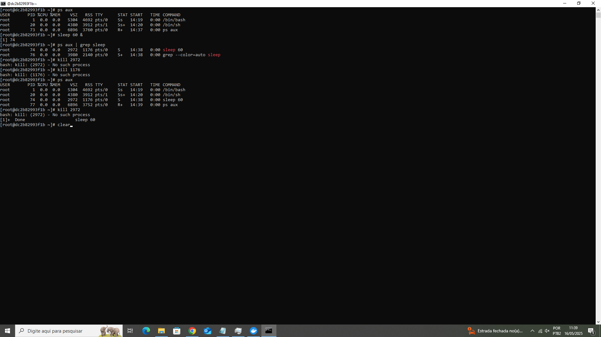

# S.O. 2025.1 - Atividade 02 - Introdução a linux usando docker no windows,
## Gabriel Henrique Furtado Barbosa, 17/05/2025

## Introdução:

+ O objetivo dessa imagem teve o objetivo de ensinar sobre outras distribuiçoes Linux, mais especificamente a Fedora.

## Relato: 

### 2.2.1. Iniciar um contêiner Fedora

+ Realizei o comando "docker run -it --name fedora-tutorial fedora:latest /bin/bash" e o pull foi realizado como esperado e o status da operação informado foi "Dowloaded newer image for fedora:latest"

### 2.2.2. Navegação básica

+ o comando pwd teve como saida o resultado "/"
+ utilizei o comando "cd ~" e fui para o diretório home do usuário
+ o comando "ls" não informou nenhum arquivo ou pasta no diretório home do usuário
+ após utilizar o comando "mkdir atividades" o "ls" passou a informar uma pasta nomeada como "atividades"
+ utilizei "cd atividades" e o prompt de comando informou que eu acessei o diretório atividades

### 2.2.3. Manipulação de arquivos

+ entrei do diretório home do usuário com o "cd ~"
+ conferi o diretório atual com "pwd"
+ criei o "arquivo1.txt" com o "touch"
+ listei os arquivos do diretório atual com o "ls", que me informou que existia o "arquivo1.txt" e o diretorio atividades no diretório home
+ renomeei o "arquivo1.txt" para "documento.txt" usando mv
+ entrei no diretorio atividades com "cd" atividades
+ criei um subdiretorio utilizando mkdir backup
+ transferi "documento.txt" que estava no diretório home do usuário para o sub diretório criado (backup)
+ voltei ao diretório home do usuário com "cd ~" e usei um pwd para ver se realmente estava nele
+ usei um "rm" document.txt para deletar o arquivo e usei um "ls" para conferir se a ação deu certo
+ usei o comando "ls atividades/backup/" para ver os arquivos dentro do novo subdiretório e ele informou que existia o arquivo "documento.txt"

### 2.2.4. Gerenciamento de pacotes

+ Utilizei o comando "dnf update -y" e foi informado que o sistema estava atualizando e carregando repositórios do sistema.
+ Utilizei o comando "dnf install nano -y" e instalei o editor de texto Nano e ocorreu tudo normalmente.

### 2.2.5. Permissões de arquivos

+ Criei o arquivo solicitado e alterei as permissões do dono, o cmd me mostrou a seguinte informação "[root@dc2b82993f1b ~]# ls -l script.sh
-rwxr--r-- 1 root root 0 May 16 14:29 script.sh"

### 2.2.6. Processos em execução

+ Listei os processos em execução, criei um processo de 60 segundos de duração, encontrei o PID desse processo e utilizei um kill para finaliza-lo.

### 2.2.7. Encerrando o contêiner

+ Utilizei o comando exit para sair do Fedora e removi o container após o uso

## Conclusão:

 Distribuições Linux contribuem positivamente para o trabalho de um desenvolvedor por conta de seus comandos que podem ser utilizados diretamente no Shell. E a imagem do Fedora utilizada por nós para criar um conteiner permitiu que pudessemos usar essa ferramenta em uma máquina que opera com o Windows, o que foi bem interessante. 
